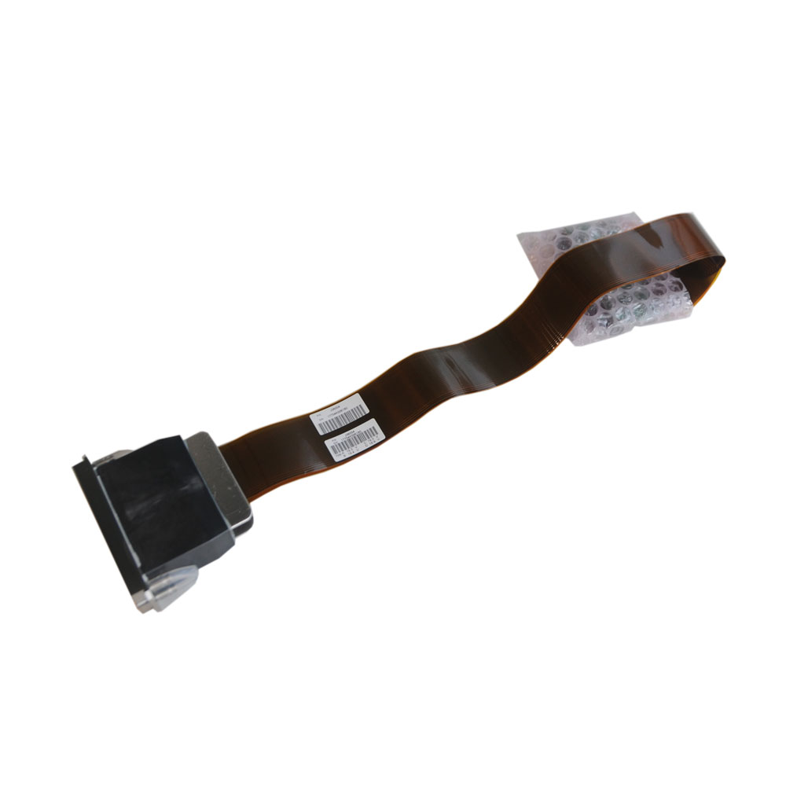
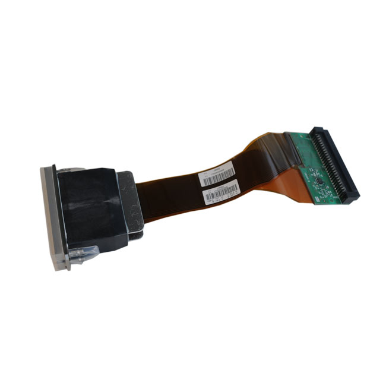
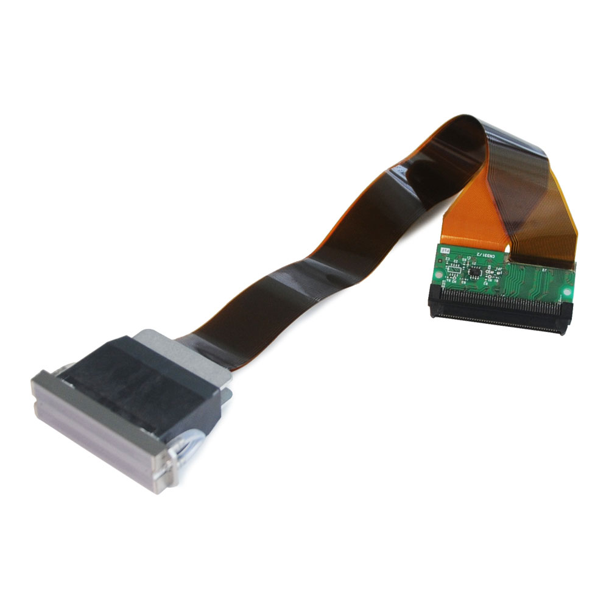
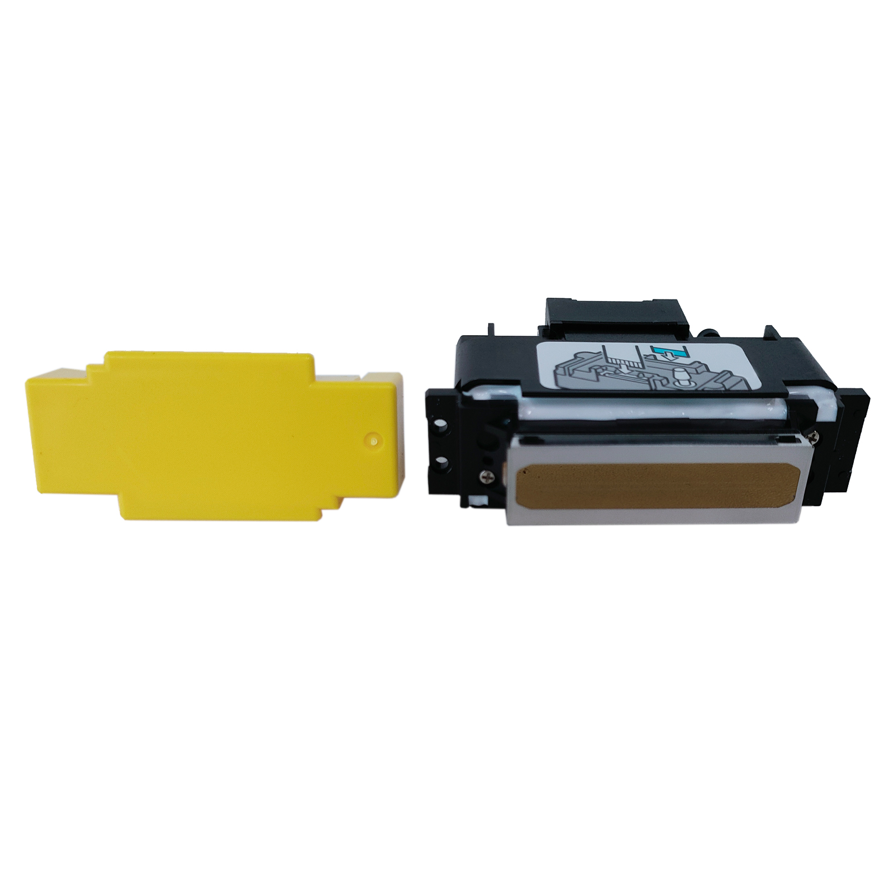

<!-- filepath: h:\Code\qiliProject\data\products\ricoh-g5s-mh5220.md -->
# Ricoh G5S (MH5220) UV Printhead - J35000

 UV Printhead - J35000/image/Ricoh G5S (MH5220) UV Printhead - J35000.img_1.jpg)

- **Model:** G5S (MH5220)
- **Type:** UV Printhead
- **Brand:** Ricoh
- **Description:** Ricoh G5S (MH5220) UV Printhead- J35000. Manufacture: Ricoh. Professional installation required. No returns/refunds after installation.
- **Price:** Contact for price

<!-- filepath: h:\Code\qiliProject\data\products\ricoh-gen4-7-35pl.md -->
# Ricoh Gen4 7-35PL Printhead (MH2420), 50cm Long w

, 50cm Long w/image/Ricoh Gen4 7-35PL Printhead (MH2420), 50cm Long w.img_1.jpg)

- **Model:** Gen4 7-35PL (MH2420)
- **Type:** Printhead
- **Brand:** Ricoh
- **Description:** Suitable for aqueous, solvent, and UV printers. Integrated heater and thermistor. 50cm long cable. Professional installation required. No returns/refunds after installation.
- **Price:** Contact for price

<!-- filepath: h:\Code\qiliProject\data\products\ricoh-gen5-7pl-water-50.md -->
# Ricoh Gen5 _ 7PL Water-based Printhead, MH5421 (50

- **Model:** Gen5 7PL Water-based (MH5421, 500mm)
- **Type:** Water-based Printhead
- **Brand:** Ricoh
- **Description:** 2 colors, 1280 nozzles, 500mm cable. Integrated heater/thermistor. Professional installation required. No returns/refunds after installation.
- **Price:** Contact for price

<!-- filepath: h:\Code\qiliProject\data\products\ricoh-gen5-7pl-water-tw.md -->
# Ricoh Gen5 _ 7PL Water-based Printhead, MH5421 (Tw

- **Model:** Gen5 7PL Water-based (MH5421, Two Color, Short Cable)
- **Type:** Water-based Printhead
- **Brand:** Ricoh
- **Description:** 2 colors, 1280 nozzles, 248mm total length. Integrated heater/thermistor. Professional installation required. No returns/refunds after installation.
- **Price:** Contact for price

<!-- filepath: h:\Code\qiliProject\data\products\ricoh-gen5-7pl-35pl-uv.md -->
# Ricoh Gen5 _ 7PL-35PL UV Printhead, 50cm Long w_ t

- **Model:** Gen5 7PL-35PL UV (N221414L)
- **Type:** UV Printhead
- **Brand:** Ricoh
- **Description:** 2 colors, 500mm total length, for Handtop/Docan Flatbed UV. Professional installation required. No returns/refunds after installation.
- **Price:** Contact for price

<!-- filepath: h:\Code\qiliProject\data\products\ricoh-gh2220.md -->
# Ricoh GH2220 Printhead

- **Model:** GH2220
- **Type:** Printhead
- **Brand:** Ricoh
- **Description:** Supports water/solvent inks, 384 nozzles, 2 colors, 32.4mm print width. Professional installation required. No returns/refunds after installation.
- **Price:** Contact for price

<!-- filepath: h:\Code\qiliProject\data\products\ricoh-mh5320.md -->
# Ricoh MH5320 Printhead, (Two Colors, 5PL) - J376-0

 - J376-0/image/Ricoh MH5320 Printhead, (Two Colors, 5PL) - J376-0.img_1.jpg)

- **Model:** MH5320 (J376-03)
- **Type:** Printhead
- **Brand:** Ricoh
- **Description:** 2 colors, 1280 nozzles, 5PL, 54.1mm print width, 500mm cable. Professional installation required. No returns/refunds after installation.
- **Price:** Contact for price

<!-- filepath: h:\Code\qiliProject\data\products\ricoh-th5241-gen5i.md -->
# Ricoh TH5241 (Gen5i) Printhead, (Four colors, 3PL)

 Printhead, (Four colors, 3PL)/image/Ricoh TH5241 (Gen5i) Printhead, (Four colors, 3PL).img_1.jpg)

- **Model:** TH5241 (Gen5i)
- **Type:** Printhead
- **Brand:** Ricoh
- **Description:** 4 colors, 1280 nozzles, 1200dpi, MEMS technology, UV/Solvent/Aqueous compatible. Professional installation required. No returns/refunds after installation.
- **Price:** Contact for price

<!-- filepath: h:\Code\qiliProject\data\products\ricoh-th6310f.md -->
# Ricoh TH6310F Printhead, (1 color, 5PL) - J388-00

 - J388-00/image/Ricoh TH6310F Printhead, (1 color, 5PL) - J388-00.img_1.jpg)

- **Model:** TH6310F (J388-00)
- **Type:** Printhead
- **Brand:** Ricoh
- **Description:** 1 color, 1600 nozzles, 600npi, 5PL, integrated heater, for aqueous/UV/solvent. Professional installation required. No returns/refunds after installation.
- **Price:** Contact for price
